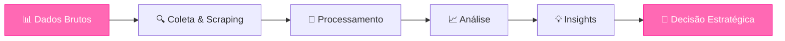

<div align="center">
  
# Hi! I'm, Hellen 🥰


</div>

  
**Supply Chain** • **S&OP** • **Demand Planning**  • **Pricing**  
**Data Analytics** • **Python** • **Power Platform** • **SQL**  
**Graduated in Production Engineering** @ FEI  
**Master in Production Engineering** @ UFSCar  
**MBA in Data Science, Artificial Intelligence and Analytics** @ USP

---

[](https://instagram.com/hellenm.araujo)
[](https://discord.gg/hellenmaraujo)
[](mailto:hellenmaria.ab@gmail.com)
[](https://www.linkedin.com/in/hellenmaria)

</div>

---

## 🌸 Sobre mim

```python
class AnalyticsEngineer:
    def __init__(self):
        self.name = "Hellen Maria"
        self.role = "Data Analytics & Business Intelligence Analyst"
        self.education = "Production Engineering @FEI"
        self.location = "São Paulo, Brasil 🇧🇷"
        
    def current_focus(self):
        return [
            "📊 Pricing analytics & competitive intelligence",
            "🚲 Product benchmarking & spec-level analytics",
            "📦 S&OP simulation & demand forecasting",
            "🤖 Data scraping & pipeline automation",
            "🏗️ Corporate data architecture",
            "📈 Machine learning for demand planning"
        ]
    
    def mindset(self):
        return "Transformando dados em vantagem competitiva 💡"
```

<div align="center">
  
### 💭 *"Não basta ter dados — é preciso transformá-los em decisão estratégica"*

</div>

---

## 🛠️ Tech Stack

<div align="center">

### 📊 Data & Analytics


### 📈 BI & Visualization


### 🤖 Automation & Web


### ⚛️ Frontend


</div>

---

## 📊 GitHub Stats

<div align="center">
  


</div>

<div align="center">
  
[](https://git.io/streak-stats)

</div>

---

## ⭐ Featured Projects

<div align="center">

| Projeto | Descrição | Tech Stack |
|---------|-----------|------------|
| **S&OP Simulator** | Simulador de impacto de cenários para ciclo S&OP | Power BI, DAX, Python |
| **Benchmarking** | Sistema de análise competitiva em nível de especificação | Python, Selenium, Pandas |
| **Pricing Intelligence** | Dashboard de inteligência de mercado e gap competitivo | Power BI, SQL, Web Scraping |
| **Automated Pipelines** | Pipelines de coleta e processamento de dados de mercado | Python, BeautifulSoup, Pandas |
| **Demand Forecasting** | Sistema de previsão de demanda com machine learning | Python, Scikit-learn, Statsmodels |

</div>

---

## 🎯 O que eu faço

<div align="center">



</div>

### Especialidades

- **Pricing Analytics**: Análise competitiva, gap analysis, estratégia de precificação
- **Market Intelligence**: Benchmarking de produtos, análise de mercado, tracking de competidores  
- **Supply Chain Analytics**: S&OP, demand planning, forecasting com ML
- **Data Engineering**: Scraping, pipelines, arquitetura de dados corporativos
- **Business Intelligence**: Dashboards estratégicos, KPIs, modelagem dimensional

---

## Atualmente estudando

<div align="center">


</div>

---

## 📚 Formação Acadêmica

🎓 **Engenharia de Produção** - Centro Universitário FEI  
📝 **TCC**: *Sales and Operations Planning: Avaliação dos Efeitos da Previsão de Demanda Utilizando Machine Learning*  
🔬 **Linha de pesquisa**: Integração de ML com S&OP para forecasting na indústria alimentícia  
📊 **Resultados**: 16.3% de erro de previsão, redução significativa de custos

---

## Filosofia

<div align="center">

> ### 🌟 Builder Analytics Mindset
> 
> **Não sou apenas analista**  
> **Não sou apenas dev**  
> **Não sou apenas engenheira**
> 
> ### Sou uma **builder analítica** com visão de processo e negócio 🚀

</div>

<div align="center">

```
┌─────────────────────────────────────────┐
│  DADOS → INSIGHTS → DECISÃO → IMPACTO  │
└─────────────────────────────────────────┘
```

</div>

---

## Vamos conversar?

<div align="center">

**Me chama!** Estou sempre aberta para trocar ideias e colaborar em projetos interessantes 💡

</div>

---

<div align="center">
  
### ✨ *Turning data into competitive advantage* ✨


</div>

<div align="center">
  


</div>
