```mermaid
graph LR
    A[📊 Dados Brutos] --> B[🔍 Coleta & Scraping]
    B --> C[🧹 Processamento]
    C --> D[📈 Análise]
    D --> E[💡 Insights]
    E --> F[🎯 Decisão Estratégica]
    
    style A fill:#ff69b4,stroke:#ff1493,color:#fff
    style F fill:#ff69b4,stroke:#ff1493,color:#fff
```

<div align="center">
  
# Hi! I'm Hellen 🥰


</div>

**Supply Chain** • **S&OP** • **Demand Planning**  • **Pricing**  
**Data Analytics** • **Python** • **Power Platform** • **SQL**  
**Graduated in Production Engineering** @ FEI  
**Master in Production Engineering** @ UFSCar (ongoing)   
**MBA in Data Science, Artificial Intelligence and Analytics** @ USP (ongoing)   

---

[](https://instagram.com/hellenm.araujo)
[](mailto:hellenmaria.ab@gmail.com)
[](https://www.linkedin.com/in/hellenmaria)

</div>

---

## 🌱 Currently learning

<div align="center">

 Machine Learning •
 Cloud Architecture •
 Advanced SQL •
 Data Modeling

</div>

---

## 🌸 About

```python
class AnalyticsEngineer:
    def __init__(self):
        self.name = "Hellen Maria"
        self.role = "Data Analytics & Business Intelligence Analyst"
        self.education = "Production Engineering @FEI"
        self.location = "São Paulo, Brasil 🇧🇷"
        
    def current_focus(self):
        return [
            "📊 Pricing analytics & competitive intelligence",
            "🚲 Product benchmarking & spec-level analytics",
            "📦 S&OP simulation & demand forecasting",
            "🤖 Data scraping & pipeline automation",
            "🏗️ Corporate data architecture",
            "📈 Machine learning for demand planning"
        ]
    
    def mindset(self):
        return "Transformando dados em vantagem competitiva 💡"
```

</div>

---

## 🛠️ Tech Stack

<div align="center">

<table>
<tr>
<td align="center"><b>Data & Analytics</b></td>
<td align="center"><b>Visualization</b></td>
<td align="center"><b>Automation & Web</b></td>
<td align="center"><b>Frontend</b></td>
</tr>

<tr>
<td>

 Python<br>
 Pandas<br>
 NumPy<br>
 Scikit-learn

</td>

<td>

 Power BI<br>
 SQL<br>
 DAX<br>
 Excel

</td>

<td>

 Selenium<br>
 BeautifulSoup<br>
 JavaScript<br>
 TypeScript

</td>

<td>

 React<br>
 HTML<br>
 CSS

</td>
</tr>
</table>

---

## 📊 GitHub Stats

<div align="center">
  
[](https://git.io/streak-stats)

</div>

---

## ⭐ Featured Projects

<div align="center">

| Projeto | Descrição | Tech Stack |
|---------|-----------|------------|
| **S&OP Simulator** | Simulador de impacto de cenários para ciclo S&OP | Power BI, DAX, Python |
| **Benchmarking** | Sistema de análise competitiva em nível de especificação | Python, Selenium, Pandas |
| **Pricing Intelligence** | Dashboard de inteligência de mercado e gap competitivo | Power BI, SQL, Web Scraping |
| **Automated Pipelines** | Pipelines de coleta e processamento de dados de mercado | Python, BeautifulSoup, Pandas |
| **Demand Forecasting** | Sistema de previsão de demanda com machine learning | Python, Scikit-learn, Statsmodels |

</div>

---

## 🎯 What I do

<div align="center">



</div>

---

<div align="center">
  
### ✨ *Turning data into competitive advantage* ✨


</div>

<div align="center">
  


</div>
